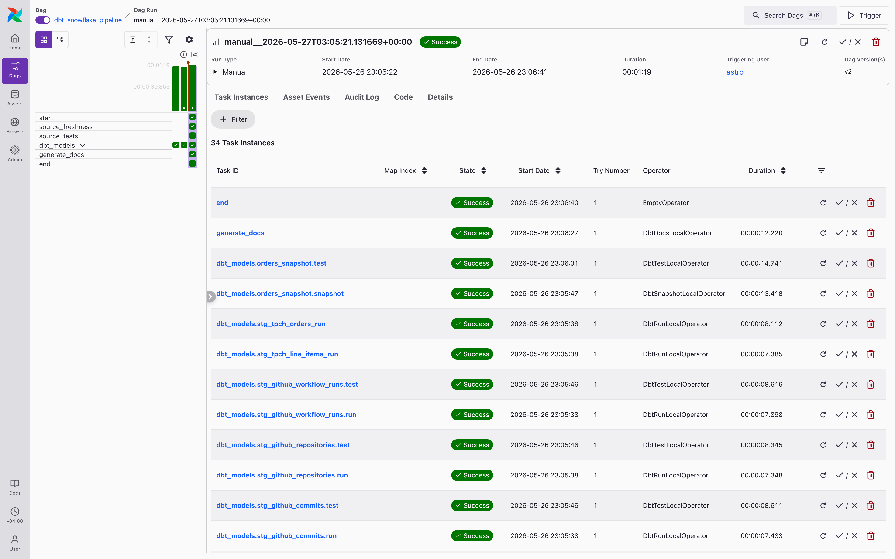
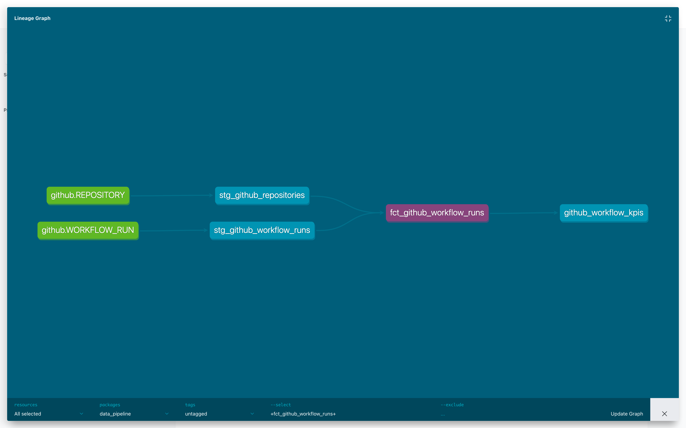
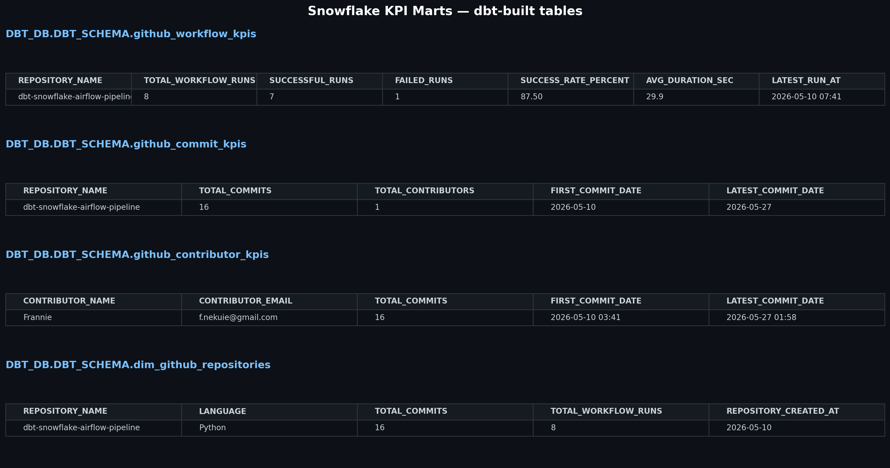
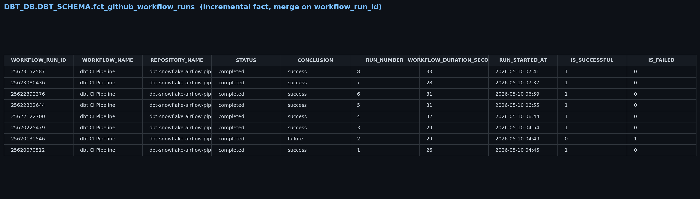
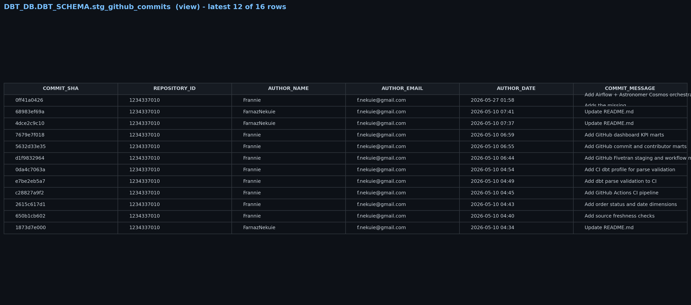

# dbt + Snowflake + Airflow Modern Data Platform

End-to-end modern ELT and analytics engineering project built with **dbt**, **Snowflake**, **Apache Airflow**, **Astronomer Cosmos**, **Fivetran**, and **GitHub Actions**.

The pipeline ingests raw GitHub data via Fivetran, transforms it into a star schema and KPI marts in Snowflake using dbt, orchestrates the workflow daily with Airflow + Cosmos, and validates every change in CI through GitHub Actions.

---

## Project Overview

This project demonstrates a production-style cloud analytics engineering workflow including:

- Automated ELT ingestion using Fivetran
- Cloud data warehousing with Snowflake
- Staging and transformation layers using dbt
- Fact and dimension modeling (star schema)
- Incremental materializations with `merge` strategy
- Source freshness monitoring
- Data quality testing (`unique`, `not_null`, `accepted_values`)
- Historical snapshots (Type-2 with `check` strategy)
- Reusable Jinja macros
- Workflow orchestration with Airflow + Astronomer Cosmos
- CI/CD validation using GitHub Actions (`dbt deps` → `dbt parse` → `dbt list`)
- GitHub operational analytics and KPI modeling
- dbt lineage and warehouse documentation

---

## Tech Stack

| Layer | Tools |
|---|---|
| Ingestion | Fivetran |
| Warehouse | Snowflake |
| Transformation | dbt Core, dbt-snowflake, dbt_utils |
| Orchestration | Apache Airflow, Astronomer Cosmos, Docker (Astro Runtime) |
| CI/CD | GitHub Actions |
| Languages | SQL, Python, Jinja, YAML |
| Source Control | Git, GitHub |

---

## Architecture Workflow

```text
GitHub  ─►  Fivetran  ─►  Snowflake (FIVETRAN_DB.GITHUB.*)
                              │
                              ▼
                   ┌──────────────────────┐
                   │   Airflow + Cosmos   │
                   └──────────┬───────────┘
                              │
                ┌─────────────┼─────────────┐
                ▼             ▼             ▼
        source_freshness  source_tests   dbt_models
                                              │
                                              ▼
                              Staging views (FIVETRAN_DB.GITHUB → DBT_SCHEMA)
                                              │
                                              ▼
                              Fact & Dim tables (star schema, incremental)
                                              │
                                              ▼
                                     Analytics KPI Marts
                                              │
                                              ▼
                                       generate_docs
                                              │
                                              ▼
                              dbt docs site + lineage graph

           Every PR also runs through GitHub Actions CI (dbt deps → parse → list)
```

---

## Project Structure

```text
data_pipeline/
├── models/
│   ├── staging/
│   │   ├── github/
│   │   │   ├── stg_github_repositories.sql
│   │   │   ├── stg_github_commits.sql
│   │   │   ├── stg_github_workflow_runs.sql
│   │   │   ├── github_sources.yml      # Fivetran sources + freshness
│   │   │   └── schema.yml              # tests + docs
│   │   ├── stg_tpch_orders.sql
│   │   ├── stg_tpch_line_items.sql
│   │   └── tpch_sources.yml
│   │
│   └── marts/
│       ├── fct_orders.sql                  # incremental
│       ├── fct_github_commits.sql          # incremental (merge on commit_sha)
│       ├── fct_github_workflow_runs.sql    # incremental (merge on workflow_run_id)
│       ├── dim_customers.sql
│       ├── dim_order_status.sql
│       ├── dim_order_dates.sql
│       ├── dim_github_contributors.sql
│       ├── dim_github_repositories.sql
│       ├── github_workflow_kpis.sql
│       ├── github_commit_kpis.sql
│       ├── github_contributor_kpis.sql
│       └── schema.yml
│
├── snapshots/
│   ├── orders_snapshot.sql             # Type-2 snapshot (check strategy)
│   └── schema.yml
│
├── macros/
│   └── pricing.sql
│
├── seeds/        tests/        analyses/
│
├── packages.yml                        # dbt_utils
├── dbt_project.yml
│
├── .github/
│   ├── workflows/dbt_ci.yml            # CI: deps → parse → compile
│   └── profiles/profiles.yml           # dummy CI profile
│
└── airflow_dbt/                        # Astronomer Cosmos orchestration
    ├── Dockerfile                      # Astro Runtime + dbt-snowflake
    ├── requirements.txt
    ├── dags/
    │   ├── dbt_dag.py                  # Cosmos DbtTaskGroup
    │   └── data_pipeline/              # full dbt project mirrored for Cosmos
    └── ...
```

---

## Data Models

### Staging (views)
| Model | Source |
|---|---|
| `stg_github_repositories` | `FIVETRAN_DB.GITHUB.REPOSITORY` |
| `stg_github_commits` | `FIVETRAN_DB.GITHUB.COMMIT` |
| `stg_github_workflow_runs` | `FIVETRAN_DB.GITHUB.WORKFLOW_RUN` |
| `stg_tpch_orders` | `SNOWFLAKE_SAMPLE_DATA.TPCH_SF1.ORDERS` |
| `stg_tpch_line_items` | `SNOWFLAKE_SAMPLE_DATA.TPCH_SF1.LINEITEM` |

### Facts (incremental tables)
| Model | Grain | Strategy |
|---|---|---|
| `fct_orders` | order | incremental |
| `fct_github_commits` | commit SHA | incremental `merge` on `commit_sha` |
| `fct_github_workflow_runs` | workflow run | incremental `merge` on `workflow_run_id` |

### Dimensions (tables)
`dim_customers`, `dim_order_status`, `dim_order_dates`, `dim_github_contributors`, `dim_github_repositories`

### KPI Marts (tables)
`github_workflow_kpis`, `github_commit_kpis`, `github_contributor_kpis`

---

## Orchestration (Airflow + Cosmos)

[`airflow_dbt/dags/dbt_dag.py`](airflow_dbt/dags/dbt_dag.py) runs the **entire dbt project** as an Airflow DAG using Astronomer Cosmos. Each dbt model becomes a discrete Airflow task with full lineage, retries, and observability.

DAG topology (`@daily`):

```text
start
  └─► source_freshness        (dbt source freshness — catches stale Fivetran data)
       └─► source_tests        (dbt test --select source:* — validates raw inputs)
            └─► dbt_models     (Cosmos TaskGroup: 29 tasks, 1 run + 1 test per dbt model + snapshot)
                 └─► generate_docs   (dbt docs generate)
                      └─► end
```

To run locally with the Astro CLI:

```bash
cd airflow_dbt
astro dev start
```

Then open http://localhost:8080 (admin/admin), add a Snowflake connection named `snowflake_conn`, and trigger the `dbt_snowflake_pipeline` DAG.

---

## CI/CD

[`.github/workflows/dbt_ci.yml`](.github/workflows/dbt_ci.yml) runs on every push and PR to `main`:

1. `dbt deps`  — install package dependencies (`dbt_utils`)
2. `dbt parse` — validate project syntax and references
3. `dbt list`  — enumerate all models, snapshots, tests, and sources to confirm DAG resolves

A dummy profile lives at `.github/profiles/profiles.yml`; no warehouse credentials are needed for CI validation. (A full `dbt build` requires real Snowflake credentials and is run in Airflow, not CI.)

---

## Local Development

```bash
# 1. Install dbt
pip install dbt-core dbt-snowflake

# 2. Configure ~/.dbt/profiles.yml with your Snowflake credentials
#    (profile name: data_pipeline)

# 3. Install dbt packages
dbt deps

# 4. Build everything
dbt build

# 5. Generate and serve docs
dbt docs generate
dbt docs serve
```

---

## Key Features

- Modern ELT pipeline architecture (Fivetran → Snowflake → dbt)
- Incremental fact tables with `merge` strategy for late-arriving and updated rows
- Star-schema modeling: facts, dimensions, and KPI marts
- Reusable Jinja macros (`pricing.sql`)
- Type-2 historical snapshots (`check` strategy on order status / total price)
- Source freshness monitoring for every Fivetran-loaded table
- Data quality tests on keys, status codes, and required fields
- Airflow + Cosmos DAG with one Airflow task per dbt model
- GitHub Actions CI pipeline (`deps` → `parse` → `compile`) on every PR
- GitHub operational analytics: contributor, commit, and workflow KPIs

---

## Screenshots

### Airflow DAG Orchestration — 34 tasks, all green
One Cosmos-generated Airflow task per dbt model, plus the surrounding `source_freshness`, `source_tests`, and `generate_docs` tasks.



### dbt Lineage Graph
Fivetran sources → staging views → incremental fact → KPI mart.



### Snowflake KPI Marts
The four analytics tables computed from real GitHub data.



### Snowflake Fact Table (incremental)
`fct_github_workflow_runs` with `merge` strategy on `workflow_run_id`.



### Snowflake Staging View
`stg_github_commits` — raw Fivetran data cleaned and renamed.


